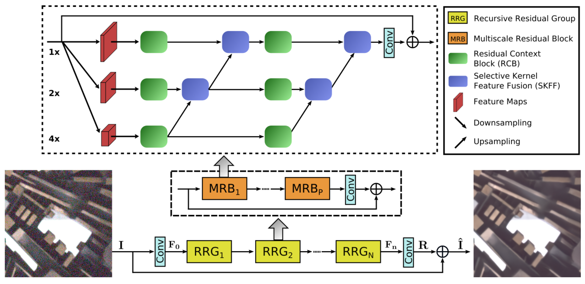

# **MIRNet V2**——飞桨特色模型挑战赛

Learning Enriched Features for Fast Image Restoration and Enhancement  论文复现

官方源码：[https://github.com/swz30/MIRNetV2](https://github.com/swz30/MIRNetV2)

复现地址：[https://github.com/sldyns/MIRNetV2_paddle](https://github.com/sldyns/MIRNetV2_paddle)

## 1. 简介



给定一个图像 $I \in {\mathbb R}^{H\times H \times 3}$，MIRNetV2 首先应用一个卷积层来提取低级特征 $X_0 \in {\mathbb R}^{H\times W\times C}$. 接下来，特征映射 $X_0$ 通过 $N$ 个递归残差组(RRGs)，产生深度特征 $X_d \in {\mathbb R}^{H\times W\times C}$. 我们注意到每个 RRG 包含多个多尺度残差块(MRB)，MRB 由多个（本文中有三个）并行连接的全卷积流组成，每个连接上先由 RCB 抑制了不太有用的特性，并且只允许信息更丰富的特性进一步传递给 SKFF，SKFF 模块通过 Fuse 和 select 两种操作对接受域进行动态调整. 接下来， 应用卷积层，得到残差图像 $R \in {\mathbb R}^{H\times H \times 3}$。最后，恢复的图像为 $\hat{I} = I+R$.

## 2. 复现精度

验收标准：SIDD PSNR: 37, SSIM: 0.94

训练20个epoch精度：SIDD PSNR: 39.0286, SSIM: 0.9554

## 3. 数据集、预训练模型、文件结构

### 数据集

下载数据并分 patch：

1. 下载 SIDD-Medium [训练数据](https://www.eecs.yorku.ca/~kamel/sidd/dataset.php) 并放在  `./SIDD_patches/train`
2. 生成图像 patches

```sh
python generate_patches_SIDD.py --ps 256 --num_patches 300 --num_cores 10
```

3. 下载 SIDD [验证数据](https://drive.google.com/drive/folders/1j5ESMU0HJGD-wU6qbEdnt569z7sM3479?usp=sharing) 并放在  `./SIDD_patches/val`

已经分好 patch 的数据：

放在了 [Ai Studio](https://aistudio.baidu.com/aistudio/datasetdetail/140841) 里.

### 预训练模型

百度网盘：[下载链接](https://pan.baidu.com/s/1De3F22gOGCI_Y5uTaDhvnw)，提取码：el7x ，下好后放在文件夹 `pretrained_models` 下

复现的模型，名为 `model_best.pdparams`.

### 文件结构

```
MIRNet_Paddle
    |-- dataloaders
    |-- SIDD_patches
         |-- train                 # SIDD-Medium 训练数据
         |-- val                   # SIDD 测试数据
         |-- train_mini            # 小训练数据，用于TIPC测试
         |-- val_mini              # 小测试数据，用于TIPC测试
    |-- logs                       # 训练日志
    |-- test_tipc                  # TIPC: Linux GPU/CPU 基础训练推理测试
    |-- networks
         |-- MIRNet_V2_model.py    # MIRNetV2模型代码
    |-- pretrained_models          # 预训练模型
    |-- utils                      # 一些工具代码
    |-- config.py                  # 配置文件
    |-- export_model.py            # 预训练模型的导出代码
    |-- generate_patches_SIDD.py   # 生成patch的代码
    |-- infer.py                   # 模型推理代码
    |-- LICENSE                    # LICENSE文件
    |-- losses.py                  # 损失函数
    |-- predict.py			      # 模型预测代码
    |-- README.md                  # README.md文件
    |-- test_denoising_sidd.py     # 测试SIDD数据上的指标
    |-- train.py                   # TIPC训练测试代码
    |-- train_denoising_1card.py   # 单机单卡训练代码
    |-- train_denoising_4cards.py  # 单机多卡训练代码
    |-- training_1card.yml         # 单机单卡训练配置文件
    |-- training_4cards.py         # 单机多卡训练配置文件
```

## 4. 环境依赖

PaddlePaddle >= 2.2.0

scikit-image == 0.19.2

## 5. 快速开始

### 单机单卡

```shell
python train_denoising_1card.py
```

配置文件为 `training_1card.yml`.

### 单机四卡

```shell
python -m paddle.distributed.launch train_denoising_4cards.py
```

此处为用四张卡，配置文件为 `training_4cards.yml`.

训练采用 Progressive learning strategy，训练图像的 Patch 大小逐渐增大，batch_size 大小同步减小.

训练过程会将模型参数保存在 `./checkpoints/Denoising/model/MIRNet_V2/` 文件夹下.

### 日志读取

训练过程会将日志记录保存在 `./checkpoints/Denoising/logs/MIRNet_V2/` 文件夹下.

日志是用 VisualDL 工具记录的，在根目录下，可通过以下方式查看：

```shell
visualdl --logdir ./checkpoints/Denoising/logs/MIRNet_V2/
```

或通过：

```python
from visualdl.server import app
app.run(logdir="./checkpoints/Denoising/logs/MIRNet_V2")
```

### 模型评估

在 SIDD 测试数据上作测试

```shell
python test_denoising_sidd.py --weights ./pretrained_models/model_best.pdparams
```

输出如下：

```
PSNR: 39.0286
SSIM: 0.9554
```

接近了验收精度.

### 模型预测

在 SIDD 小验证集上作预测，结果存放在 `results/` 文件夹下

```
python predict.py --model_ckpt ./pretrained_models/model_best.pdparams --data_path ./SIDD_patches/val_mini/ --save_path results/ --save_images
```

输出为：

```
PSNR on test data 41.5405, SSIM on test data 0.9799
```

### 推理过程：

需要安装 reprod_log：

```
pip install reprod_log
```

模型动转静导出：

```
python export_model.py --model-dir ./pretrained_models/model_best.pdparams --save-inference-dir ./output/
```

最终在`output/`文件夹下会生成下面的3个文件：

```
output
  |----model.pdiparams     : 模型参数文件
  |----model.pdmodel       : 模型结构文件
  |----model.pdiparams.info: 模型参数信息文件
```

总大小为 19.21 Mb < 20 Mb.

模型推理：

```
python infer.py --model-dir output --use-gpu True --benchmark False --clean-dir=./SIDD_patches/val_mini/groundtruth/0000-0000.png --noisy-dir=./SIDD_patches/val_mini/input/0000-0000.png
```

输出结果为：

```
image_name: ./SIDD_patches/val_mini/input/0000-0000.png, psnr: 42.20094819639691
```

## 6. TIPC

首先安装AutoLog（规范化日志输出工具）

```
pip install  https://paddleocr.bj.bcebos.com/libs/auto_log-1.2.0-py3-none-any.whl
```

在linux下，进入 MIRNet_paddle 文件夹，运行命令：

```
bash test_tipc/prepare.sh ./test_tipc/configs/MIRNet_V2/train_infer_python.txt 'lite_train_lite_infer'
bash test_tipc/test_train_inference_python.sh ./test_tipc/configs/MIRNet_V2/train_infer_python.txt 'lite_train_lite_infer'
```

## 7. LICENSE

本项目的发布受[Apache 2.0 license](https://github.com/PaddlePaddle/models/blob/release/2.2/community/repo_template/LICENSE)许可认证

